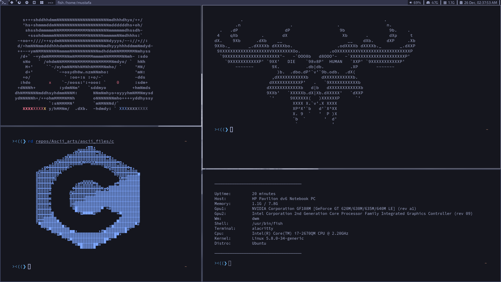
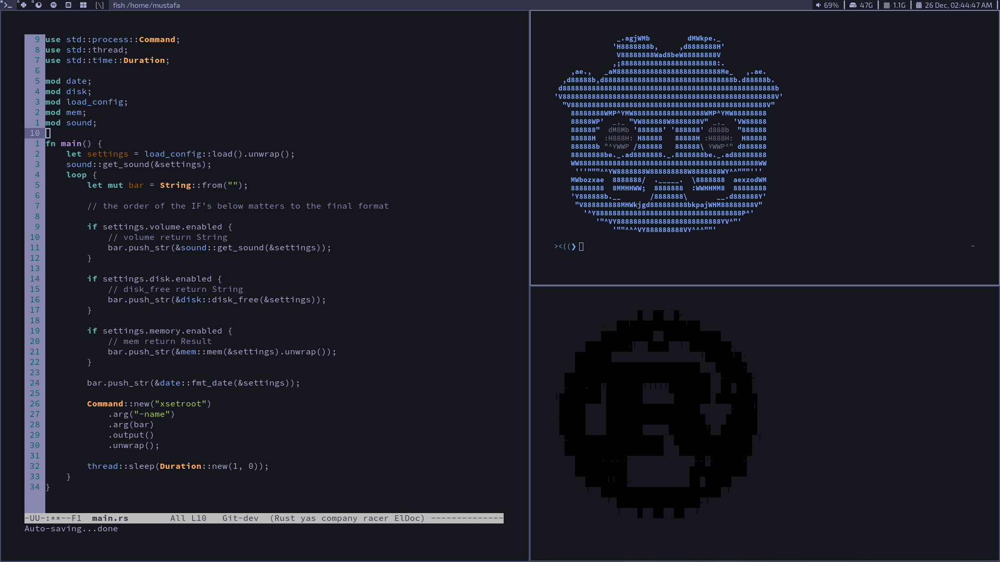

# mustafa's build of dwm

## Screenshots

	

 

	

 

	

 

## Patches
All the patches included in the `patchs` folder, (in case you want to just download the patch and apply it on your own build).

* [dwm-fibonacci](https://dwm.suckless.org/patches/fibonacci/) This patch adds 2 new layouts (`spiral` and `dwindle`).
* [dwm-status2d](https://dwm.suckless.org/patches/status2d/) This patch allow colors and rectangle drawing in the status bar.
* [always-center](https://dwm.suckless.org/patches/alwayscenter/) This patch center any spawning window when `floating` layout is active.
